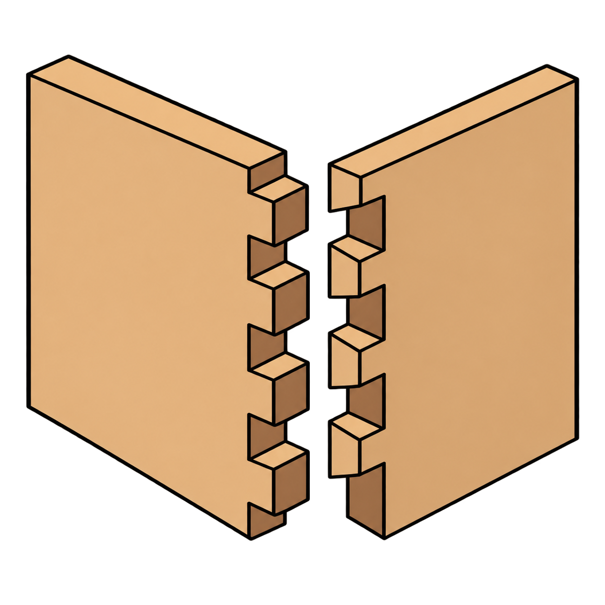
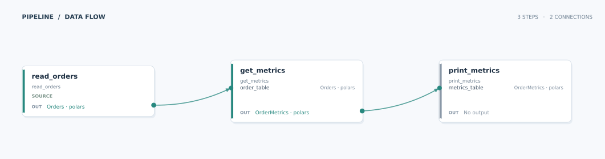

# Data Joinery

<figure markdown="span">
{ width="300" }
<figcaption>Schema first data transformations</figcaption>
</figure>

## Overview

Data Joinery is a small framework that allows you to build complex transformation jobs with an emphasis on
testability. It helps you break apart complex transformations into testable units, whilst
allowing you to annotate these transformations with the upstream/downstream schemas.
Without a schema contract, a transformation might be declared as:

``` python
def get_metrics(fact_table: DataFrame) -> DataFrame:
    ...
```

From this we have no idea what the inputs or outputs of the transformation are. With Data Joinery you
can make it much clearer:

=== "Polars"

    ``` python
    --8<-- "docs_src/index/intro_polars.py:5:"
    ```

=== "PySpark"

    ``` python
    --8<-- "docs_src/index/intro_spark.py:5:"
    ```

Using a schema first approach makes it much clearer what this transformation does, for
both you and a coding agent. Data Joinery will also enforce at runtime that the input and output
schemas match the type annotations.

## A complete pipeline

This example reads orders, groups them by day and customer, and checks the schema at each step:



Open the [full-size pipeline figure](images/homepage-pipeline.svg) to inspect the step inputs and outputs.

=== "Polars"

    ``` python
    --8<-- "docs_src/index/minimum_example_polars.py"
    ```

    :fontawesome-solid-code: Outputs:

    ``` text
    --8<-- "docs_src/index/minimum_example_polars_stdout.log"
    ```

=== "PySpark"

    ``` python
    --8<-- "docs_src/index/minimum_example_spark.py"
    ```

    :fontawesome-solid-code: Outputs:

    ``` text
    --8<-- "docs_src/index/minimum_example_spark_stdout.log"
    ```

## Installation

Data joinery can work with Polars or PySpark. To install everything, use:

``` bash title="Install with pip"
pip install "data-joinery[all]"
```

``` bash title="Install with uv"
uv add "data-joinery[all]"
```

### Just PySpark

``` bash title="Install with pip"
pip install "data-joinery[pyspark]"
```

``` bash title="Install with uv"
uv add "data-joinery[pyspark]"
```

### Just Polars

``` bash title="Install with pip"
pip install "data-joinery[polars]"
```

``` bash title="Install with uv"
uv add "data-joinery[polars]"
```
