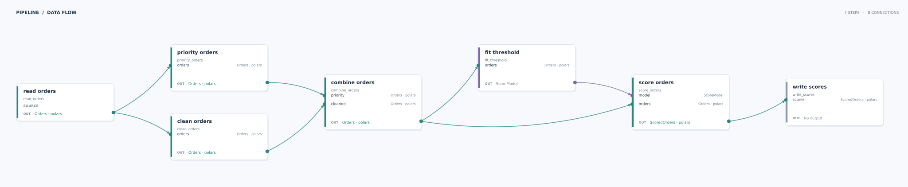

# Pipelines

!!! example

    Pipeline syntax is experimental

Pipelines allow you to chain together multiple transformations. The pipeline will validate
that the output of each transformation is compatible with the input of the next one.
After running a pipeline, see [Inspecting Pipeline Runs](inspecting_pipeline_runs.md)
to read a step's result.

## Defining a pipeline

To define a pipeline first create all your transformations and input/output schemas. Then create
your pipeline class and add each transformation as a `Step`. A `Step` represents a single
instance of that transformation within the pipeline. This distinction allows you to reuse the same
transformation multiple times within the same pipeline. Once the transformations have been added
you must connect them together using the `connect` method. This method will verify that the
transformations are compatible and can be connected together:

=== "Polars"

    ``` python
    --8<-- "docs_src/learn/pipelines/index/pipeline_connect_happy_polars.py"
    ```

    :fontawesome-solid-code: Outputs:

    ``` text
    --8<-- "docs_src/learn/pipelines/index/pipeline_connect_happy_polars_stdout.log"
    ```

=== "PySpark"

    ``` python
    --8<-- "docs_src/learn/pipelines/index/pipeline_connect_happy_spark.py"
    ```

    :fontawesome-solid-code: Outputs:

    ``` text
    --8<-- "docs_src/learn/pipelines/index/pipeline_connect_happy_spark_stdout.log"
    ```

## Validating the pipeline

The pipeline will validate itself as you connect transformations. If there is a schema or type
incompatibility then you will see a `PipelineConnectionError`. An example of this is shown below:

=== "Polars"

    ``` python
    --8<-- "docs_src/learn/pipelines/index/pipeline_connect_mismatch_polars.py"
    ```

    :fontawesome-solid-code: Outputs:

    ``` text
    --8<-- "docs_src/learn/pipelines/index/pipeline_connect_mismatch_polars_stdout.log"
    ```

=== "PySpark"

    ``` python
    --8<-- "docs_src/learn/pipelines/index/pipeline_connect_mismatch_spark.py"
    ```

    :fontawesome-solid-code: Outputs:

    ``` text
    --8<-- "docs_src/learn/pipelines/index/pipeline_connect_mismatch_spark_stdout.log"
    ```

The pipeline will also fail to run if you have left a transformation 'dangling', meaning that it
is missing a connection for one of it's upstream dependencies:

=== "Polars"

    ``` python
    --8<-- "docs_src/learn/pipelines/index/pipeline_connect_dangling_transformation_polars.py"
    ```

    :fontawesome-solid-code: Outputs:

    ``` text
    --8<-- "docs_src/learn/pipelines/index/pipeline_connect_dangling_transformation_polars_stdout.log"
    ```

=== "PySpark"

    ``` python
    --8<-- "docs_src/learn/pipelines/index/pipeline_connect_dangling_transformation_spark.py"
    ```

    :fontawesome-solid-code: Outputs:

    ``` text
    --8<-- "docs_src/learn/pipelines/index/pipeline_connect_dangling_transformation_spark_stdout.log"
    ```

## Detecting cycles

The pipeline will automatically detect cycles as you build it to ensure that the end result is
runnable. The below example shows how the error is raised as you are connecting transformations:

=== "Polars"

    ``` python
    --8<-- "docs_src/learn/pipelines/index/pipeline_connect_cycle_polars.py"
    ```

    :fontawesome-solid-code: Outputs:

    ``` text
    --8<-- "docs_src/learn/pipelines/index/pipeline_connect_cycle_polars_stdout.log"
    ```

=== "PySpark"

    ``` python
    --8<-- "docs_src/learn/pipelines/index/pipeline_connect_cycle_spark.py"
    ```

    :fontawesome-solid-code: Outputs:

    ``` text
    --8<-- "docs_src/learn/pipelines/index/pipeline_connect_cycle_spark_stdout.log"
    ```

## Instance inputs/outputs

Pipeline steps can link transformations that accept and produce instance values. This allows you to pass around
typed objects such as machine learning models, pandas DataFrames or any general Python object
between steps in the pipeline. For instance contracts, the pipeline only validates that the runtime class is
compatible between the input and output; it does not perform schema coercion.

This PySpark example reads data, engineers features, and trains an ML model.
The trained model is passed as an instance value:

``` python
--8<-- "docs_src/learn/pipelines/index/pipeline_connect_instance_output_spark.py"
```

:fontawesome-solid-code: Outputs:

``` md
--8<-- "docs_src/learn/pipelines/index/pipeline_connect_instance_output_spark_stdout.log"
```

Generic type annotations such as `list[str]` are not supported for instance
values. Instance contracts validate runtime classes and do not inspect the contents of
generic containers. An unsupported annotation fails when the transform is defined:

``` python
--8<-- "docs_src/learn/pipelines/index/pipeline_connect_instance_output_generic_type_failure.py"
```

:fontawesome-solid-code: Outputs:

``` md
--8<-- "docs_src/learn/pipelines/index/pipeline_connect_instance_output_generic_type_failure_stdout.log"
```

Wrap structured values in a named class when their internal types are important to the
pipeline contract.

Similarly to best practice with [context](context.md), you should avoid primitive types such as
`int`, `datetime`, etc and prefer either wrapper types or classes to be explicit on input/outputs:

=== "Polars"

    ``` python
    --8<-- "docs_src/learn/pipelines/index/pipeline_connect_instance_good_practice_polars.py"
    ```

    :fontawesome-solid-code: Outputs:

    ``` text
    --8<-- "docs_src/learn/pipelines/index/pipeline_connect_instance_good_practice_polars_stdout.log"
    ```

=== "PySpark"

    ``` python
    --8<-- "docs_src/learn/pipelines/index/pipeline_connect_instance_good_practice_spark.py"
    ```

    :fontawesome-solid-code: Outputs:

    ``` text
    --8<-- "docs_src/learn/pipelines/index/pipeline_connect_instance_good_practice_spark_stdout.log"
    ```

!!! warning "Don't crash your driver node!"

    Instance values are held in the process running the pipeline. In PySpark, collecting
    a large DataFrame into an instance value uses driver memory.

## Visualizing data flow

Install the `vis` extra and call `pipeline.visualize()` after connecting the steps.
The figure places steps from left to right in flow order. Each card shows its step name,
transformation, inputs, and output type. Arrows point to the parameter that receives the
data. Teal marks DataFrames, purple marks instance values, and grey marks steps without
an output. Context dependencies appear inside the relevant step card.

This example splits the orders into two branches, combines them, then passes both
DataFrames and a fitted model into later steps:



Open the [full-size figure](../../images/pipeline-data-flow.svg) to inspect each input and output.

??? example "Pipeline used in the figure"

    ``` python
    --8<-- "docs_src/learn/pipelines/index/pipeline_visualisation_polars.py"
    ```

    :fontawesome-solid-code: Outputs:

    ``` text
    --8<-- "docs_src/learn/pipelines/index/pipeline_visualisation_polars_stdout.log"
    ```

Pass `show=False` to `visualize()` to get the Matplotlib figure without opening a window.
Use the returned figure's `savefig()` method to save a PNG or SVG. SVG works well for
large pipelines because you can zoom in without losing detail.
